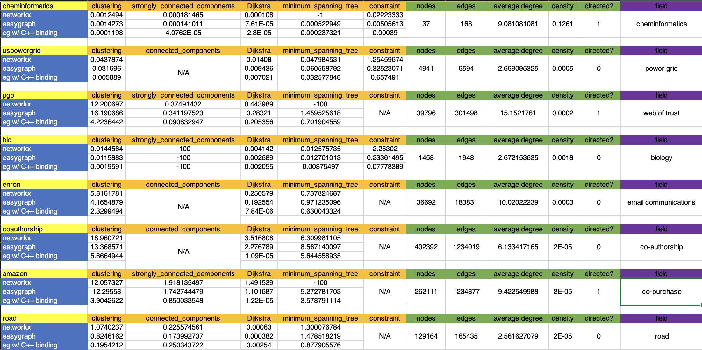

# easygraph-bench

[](https://github.com/tddschn/easygraph-bench/actions/workflows/bench-all.yaml)

This repository includes code for benchmarking the performance of graph libraries including easygraph.


- [easygraph-bench](#easygraph-bench)
  - [Objectives](#objectives)
    - [Objective 1](#objective-1)
    - [Objective 2](#objective-2)
  - [Benchmarking method](#benchmarking-method)
  - [Benchmarked methods](#benchmarked-methods)
    - [For Objective 1](#for-objective-1)
    - [For Objective 2](#for-objective-2)
  - [Run](#run)
    - [Run locally](#run-locally)
      - [Prerequisites](#prerequisites)
    - [Run on GitHub Actions (for Objective 1 only)](#run-on-github-actions-for-objective-1-only)
  - [Result visualization (for Objective 1 only)](#result-visualization-for-objective-1-only)
  - [Datasets](#datasets)
  - [Results](#results)
    - [Results downloads](#results-downloads)

## Objectives
### Objective 1
Benchmarking code that compares the performance of the 2 graph libraries [easygraph](https://github.com/easy-graph/Easy-Graph) (with and without C++ binding) and [networkx](https://networkx.org).

### Objective 2
Benchmarking code that compares the performance of 6 graph libraries  
`easygraph`, `networkx`, `igraph`, `graphtool`, `networkit`, `snap-stanford`.  
on these methods `loading`, `2-hops`, `shortest path`, `k-core`, `page rank`, `strongly connected components`.

## Benchmarking method

[timeit.Timer.autorange](https://docs.python.org/3.10/library/timeit.html#timeit.Timer.autorange) is used to run the specified methods on the graph objects.

If the method returns a Generator, the result will be exhausted.

See [get_Timer_args()](https://github.com/tddschn/easygraph-bench/blob/69cc89889e39386f495b7fa07be3116443cc9356/utils.py#L191) for more details.
 
## Benchmarked methods

### For Objective 1

See [config.py](./config.py) for more details.

- clustering_methods: `["average_clustering", "clustering"]`  
    (`eg.average_clustering` vs `nx.average_clustering`, ...)
- shortest_path_methods: `[('Dijkstra', 'single_source_dijkstra_path')]`  
    (`eg.Dijkstra` vs `nx.single_source_dijkstra_path`)
<!-- - connected_components_methods: `[ "is_connected", "number_connected_components", "connected_components", ("connected_component_of_node", 'node_connected_component'), ]` -->
- connected_components_methods: `["is_biconnected", "biconnected_components"]`
- mst_methods: `['minimum_spanning_tree']`  
    C++ binding not supported for this method yet.
- other_methods: `['density', 'constraint']`.

### For Objective 2

<details>
  <summary>Click to expand</summary>


  Source: [graph-benchmark-code.yaml](timlrx/graph-benchmark-code.yaml)

  The data (except the easygraph related part) is this yaml file is extracted from `timlrx`'s [graph-benchmark](https://github.com/timlrx/graph-benchmark) repository with `semgrep`.

  See the [timlrx](./timlrx/) directory for more details.
  
  ```yaml

  easygraph:
    loading: '''read_edgelist(filename, delimiter="\t", nodetype=int, create_using=eg.DiGraph()).cpp()'''
    loading_undirected: '''read_edgelist(filename, delimiter="\t", nodetype=int, create_using=eg.Graph()).cpp()'''
    # page rank: "'pagerank(g)'"
    shortest path: f'Dijkstra(g, {nodeid})'
    strongly connected components: "'[i for i in strongly_connected_components(g)]'"
    graphtool:
    2-hops: '"shortest_distance(g, g.vertex(0), max_dist=2).a"'
    k-core: "'kcore_decomposition(g).a'"
    loading:
        '''''''load_graph_from_csv(filename, directed=True, csv_options={''delimiter'':
        ''\t'', ''quotechar'': ''"''})'''''''
    loading_undirected:
        '''''''load_graph_from_csv(filename, directed=False, csv_options={''delimiter'':
        ''\t'', ''quotechar'': ''"''})'''''''
    page rank: "'pagerank(g, damping=0.85, epsilon=1e-3, max_iter=10000000).a'"
    shortest path: '"shortest_distance(g, g.vertex(0)).a"'
    strongly connected components:
        "'cc, _ = label_components(g, vprop=None, directed=True,
        attractors=False); cc.a'"
    igraph:
    k-core: '"g.coreness(mode=''all'')"'
    loading: '"Graph.Read(filename, format=''edges'')"'
    loading_undirected: '"Graph.Read(filename, format=''edges'', directed=False)"'
    page rank: '"g.pagerank(damping=0.85)"'
    shortest path: '"g.shortest_paths([g.vs[0]])"'
    strongly connected components: '"[i for i in g.components(mode=STRONG)]"'
    networkit:
    k-core: '"nk.centrality.CoreDecomposition(g).run().scores()"'
    loading:
        '"nk.graphio.EdgeListReader(separator=''\t'', firstNode=0, continuous=True,
        directed =True).read(filename)"'
    loading_undirected: '"nk.graphio.EdgeListReader(separator=''\t'', firstNode=0, continuous=True).read(filename)"'
    page rank: '"nk.centrality.PageRank(g, damp=0.85, tol=1e-3).run().scores()"'
    shortest path: '"nk.distance.BFS(g, 0, storePaths=False).run().getDistances(False)"'
    strongly connected components: '"nk.components.StronglyConnectedComponents(g).run().getPartition().getVector()"'
    networkx:
    2-hops: f'single_source_shortest_path_length(g, {nodeid}, cutoff=2)'
    k-core: "'core.core_number(g)'"
    loading: '''read_edgelist(filename, delimiter="\t", nodetype=int, create_using=nx.DiGraph())'''
    loading_undirected: '''read_edgelist(filename, delimiter="\t", nodetype=int, create_using=nx.Graph())'''
    page rank: "'pagerank(g, alpha=0.85, tol=1e-3, max_iter=10000000)'"
    shortest path: f'shortest_path_length(g, {nodeid})'
    strongly connected components: "'[i for i in strongly_connected_components(g)]'"
    snap:
    2-hops: '"snap.GetNodesAtHop(g, 0, 2, NodeVec, True)"'
    k-core: '"snap.GetKCoreNodes(g, CoreIDSzV)"'
    loading: '"snap.LoadEdgeListStr(snap.PNGraph, filename, 0, 1)"'
    page rank: '"snap.GetPageRank(g, PRankH, 0.85, 1e-3, 10000000)"'
    shortest path: '"snap.GetShortPath(g, 0, NIdToDistH, True)"'
    strongly connected components: '"snap.GetSccs(g, Components)"'
    
```


</details>


## Run

### Run locally

#### Prerequisites

`python >= 3.10` is required.

First, you need to download datasets manually or with a script like [this one](./scripts/download_data.sh).

To run these scripts, you need to clone the repo and install the dependencies listed in requirements.txt.

To install `easygraph`:  
As of 8/6/2022, wheel for `python-easygraph` is not available on PyPI, and you need to build it yourself and install the module by running the following code.

```bash
git clone https://github.com/easy-graph/Easy-Graph && cd Easy-Graph && git checkout pybind11
pip install pybind11
python3 setup.py install
```

To install other 5 graph libraries on conda, run

```bash
conda install -c conda-forge python-igraph graph-tool networkit snap-stanford -y
python3 -m pip install networkx
```


<!-- For macOS users, you may try the following snippet to do that:

```bash
git clone https://github.com/easy-graph/Easy-Graph && cd Easy-Graph
brew install boost --build-from-source
brew install boost-python

[ -d 'build'] && rm -rf build/

# modify line below based on your machine configuration, don't copy and run verbatim!
# you may also need to install clang or clang++ if you haven't already.
python3 setup.py build_ext -l boost_python310 -L "/usr/local/Cellar/boost-python3/1.79.0/lib" -I "/usr/local/Cellar/boost/1.79.0/include"

python3 setup.py install
``` -->

#### For Objective 1

You can run benchmarking on a single dataset with the `./bench_*.py` scripts,  
or run benchmarking on a set of datasets with the `./entrypoint_*.py` scripts,
or run all of them `./bench.sh`.

<!-- - Run benchmarks on a single dataset  
    You can choose what method category to benchmark via `-G`. See [Scripts usage](#scripts-usage).
    - [./bench_cheminformatics.py](./bench_cheminformatics.py): Run benchmarks on the cheminfomatics dataset
    - [./bench_bio.py](./bench_bio.py): Run benchmarks on the bio dataset
    - [./bench_eco.py](./bench_eco.py): Run benchmarks on the eco dataset
    - [./bench_soc.py](./bench_soc.py): Run benchmarks on the soc dataset (WIP)
- Run benchmarks on all datasets  
    - [./bench.py](./bench.py): Run benchmarks on all datasets  
        You can choose what method category to benchmark via `-G`. See [Scripts usage](#scripts-usage).
- Deprecated  
    - [./archive/bench.py](./archive/bench.py):  
    Deprecated, modified and parameterized from [@coreturn](https://github.com/coreturn)'s benchmarking script.  
    Only run the methods once with and record the difference of the result of `time.time()` calls as the time spent.  
    Use the following scripts instead. -->

#### For Objective 2

You can run benchmarking on a single dataset for a single library with the `./profile_*.py` scripts, or use the convenience script `./profile_entrypoint.sh` to profile a bunch of datasets for the 6 libraries (you may need to adjust the dataset locations for this script to work).

#### Scripts usage

```
# For Objective 1
# the ./bench_*.py scripts are for benchmarking easygraph and networkx on a single or all datasets

$ ./bench_cheminfo.py --help

ENZYMES_g1: nodes: 37 edges: 84
usage: bench_cheminfo.py [-h] [-G {clustering,shortest-path,connected-components,mst} [{clustering,shortest-path,connected-components,mst} ...]] [-C]

EasyGraph & NetworkX side-by-side benchmarking

optional arguments:
  -h, --help            show this help message and exit
  -G {clustering,shortest-path,connected-components,mst} [{clustering,shortest-path,connected-components,mst} ...], --method-group {clustering,shortest-path,connected-components,mst} [{clustering,shortest-path,connected-components,mst} ...]
  -C, --skip-cpp-easygraph, --skip-ceg
                        Skip benchmarking cpp_easygraph methods (default: False)
```

```
# for Objective 2
# the ./profile_*.py scripts are for profiling the one graph library on dataset of your choice.

# examples:
# ./profile_igraph.py my_dataset/my_network.edgelist -n 1000
# run the benchmarked methods of igraph on my_network.edgelist dataset for 1000 times, the dataset will be read as a directed graph.
# ./profile_networkx_undirected.py bio.edgelist
# read bio.edgelist as an undirected graph.

$ ./profile_easygraph.py D
usage: profile_easygraph.py [-h] [-n INT] PATH

Benchmark easygraph

positional arguments:
  PATH                  path to the dataset file in tab-separated edgelist format

options:
  -h, --help            show this help message and exit
  -n INT, --iteration INT
                        iteration count when benchmarking, auto-determined if unspecified (default: None)
```

<!-- #### Run on a custom dataset

See [./bench_cheminfo.py](./bench_cheminfo.py).

Modify the dataset loading function `load_cheminformatics` to load your own dataset. -->

### Run on GitHub Actions (for Objective 1 only)

Fork this repo, go to the Actions tab and click Run Workflow.

## Result visualization (for Objective 1 only)

`timeit` results are saved in csv files, and `seaborn` is used to render and save the figures in the `images/` directory.

Image generation is slow, use `-D` or `--skip-draw` when running `./bench_*.py` to skip image generation.

<!-- The figures look like this:
 -->

<!-- See [Complete results](#complete-results). -->


## Datasets

See [dataset_loaders.py](./dataset_loaders.py) and [dataset](./dataset/) for details.


The `er_*` Erdos-Renyi random graphs are generated with `eg.erdos_renyi_P()`, available [here](https://github.com/tddschn/easygraph-bench/releases/tag/random-erdos-renyi-datasets).


<!-- BEGIN DATASET TABLE -->

| Dataset Name                                                                                            | nodes   | edges    | is_directed | average_degree     | density                | type                                     |
| ------------------------------------------------------------------------------------------------------- | ------- | -------- | ----------- | ------------------ | ---------------------- | ---------------------------------------- |
| [stub](https://github.com/tddschn/easygraph-bench/blob/master/dataset_loaders.py)                       | 5       | 10       | False       | 4.0                | 1.0                    | easygraph.classes.graph.Graph            |
| [stub_with_underscore](https://github.com/tddschn/easygraph-bench/blob/master/dataset_loaders.py)       | 5       | 10       | False       | 4.0                | 1.0                    | easygraph.classes.graph.Graph            |
| [stub_directed](https://github.com/tddschn/easygraph-bench/blob/master/dataset_loaders.py)              | 5       | 20       | True        | 8.0                | 1.0                    | easygraph.classes.directed_graph.DiGraph |
| [stub_nx](https://github.com/tddschn/easygraph-bench/blob/master/dataset_loaders.py)                    | 5       | 10       | False       | 4.0                | 1.0                    | networkx.classes.graph.Graph             |
| [cheminformatics](https://networkrepository.com/ENZYMES-g1.php)                                         | 37      | 168      | True        | 9.08108108108108   | 0.12612612612612611    | easygraph.classes.directed_graph.DiGraph |
| [eco](https://networkrepository.com/econ-mahindas.php)                                                  | 1258    | 7619     | False       | 12.112877583465819 | 0.009636338570776308   | networkx.classes.graph.Graph             |
| [bio](https://networkrepository.com/bio-yeast.php)                                                      | 1458    | 1948     | False       | 2.672153635116598  | 0.0018340107310340413  | easygraph.classes.graph.Graph            |
| [uspowergrid](https://toreopsahl.com/datasets/#uspowergrid)                                             | 4941    | 6594     | False       | 2.66909532483303   | 0.0005403026973346214  | networkx.classes.graph.Graph             |
| [enron](https://snap.stanford.edu/data/email-Enron.html)                                                | 36692   | 183831   | False       | 10.020222391802028 | 0.00027309755503535    | networkx.classes.graph.Graph             |
| [pgp](https://github.com/tddschn/easygraph-bench/blob/master/dataset/pgp/pgp.xml)                       | 39796   | 301498   | True        | 15.15217609810031  | 0.00019037788790175037 | networkx.classes.digraph.DiGraph         |
| [pgp_undirected](https://github.com/tddschn/easygraph-bench/blob/master/dataset/pgp/pgp_undirected.xml) | 39796   | 197150   | False       | 9.908030957885215  | 0.00024897677994434515 | networkx.classes.graph.Graph             |
| [road](https://networkrepository.com/road-usa.php)                                                      | 129164  | 165435   | False       | 2.5616270787525934 | 1.9832514564949666e-05 | easygraph.classes.graph.Graph            |
| [amazon](https://snap.stanford.edu/data/amazon0302.html)                                                | 262111  | 1234877  | True        | 9.42254998836371   | 1.7974419114806206e-05 | networkx.classes.digraph.DiGraph         |
| [coauthorship](https://github.com/chenyang03/co-authorship-network)                                     | 402392  | 1234019  | False       | 6.1334171653512    | 1.5242431280399412e-05 | networkx.classes.graph.Graph             |
| [google](https://snap.stanford.edu/data/web-Google.html)                                                | 875713  | 5105039  | True        | 11.659160021605253 | 6.656960291514363e-06  | networkx.classes.digraph.DiGraph         |
| [pokec](https://snap.stanford.edu/data/soc-Pokec.html)                                                  | 1632803 | 30622564 | True        | 37.50919614919865  | 1.148614349725155e-05  | networkx.classes.digraph.DiGraph         |
| er_200                                                                                                  | 200     | 4028     | False       | 40.28              | 0.20241206030150755    | easygraph.classes.graph.Graph            |
| er_200_directed                                                                                         | 200     | 3818     | True        | 38.18              | 0.09592964824120603    | easygraph.classes.directed_graph.DiGraph |
| er_500                                                                                                  | 500     | 24807    | False       | 99.228             | 0.19885370741482966    | easygraph.classes.graph.Graph            |
| er_500_directed                                                                                         | 500     | 24778    | True        | 99.112             | 0.09931062124248496    | easygraph.classes.directed_graph.DiGraph |
| er_1000                                                                                                 | 1000    | 99731    | False       | 199.462            | 0.19966166166166166    | easygraph.classes.graph.Graph            |
| er_1000_directed                                                                                        | 1000    | 99542    | True        | 199.084            | 0.09964164164164165    | easygraph.classes.directed_graph.DiGraph |
| er_2000                                                                                                 | 2000    | 400568   | False       | 400.568            | 0.20038419209604802    | easygraph.classes.graph.Graph            |
| er_2000_directed                                                                                        | 2000    | 399795   | True        | 399.795            | 0.09999874937468735    | easygraph.classes.directed_graph.DiGraph |
| er_5000                                                                                                 | 5000    | 2496529  | False       | 998.6116           | 0.1997622724544909     | easygraph.classes.graph.Graph            |
| er_5000_directed                                                                                        | 5000    | 2500063  | True        | 1000.0252          | 0.10002252450490098    | easygraph.classes.directed_graph.DiGraph |


<!-- END DATASET TABLE -->

I don't know how to do that while sticking to the DRY principle. 

But if you know, please tell me. :)

## Results

- Machine: MacBookPro16,2 (Mid-2020 MacBook Pro, Intel i7-1068NG7 (8) @ 2.30GHz, 16GB RAM)
- OS: macOS Monterey 12.6 21G115 x86_64
- python: Python 3.10.5 | packaged by conda-forge | (main, Jun 14 2022, 07:03:09) [Clang 13.0.1 ] on darwin

Results were generated by downloading all the datasets and running `./bench.sh`.

<!-- The benchmarking were run on Ubuntu 20.04 with GitHub Actions on [GitHub-hosted runners](https://docs.github.com/en/actions/using-github-hosted-runners/about-github-hosted-runners#cloud-hosts-used-by-github-hosted-runners) with CPython 3.10. -->


<!-- Results were generated by running `./bench.py`. See also [bench.yaml](./.github/workflows/bench.yaml). -->

Objective 1:



### Results downloads

You can download the benchmarking results on the [Releases](https://github.com/tddschn/easygraph-bench/releases) page.

<!-- ### Complete results

Click on the triangles to see the results.  
The images may take sometime to load.

`avg_time == -1` means method not supported by graph type (`NetworkXNotImplemented` or `EasyGraphNotImplemented` exceptions thrown).

`avg_time == -10` means that the benchmarking of this method was timed out. -->

<!-- the markdown code below this line is auto generated by `./gen_results_markdown.py` -->


